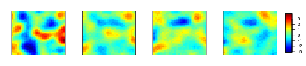
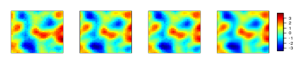
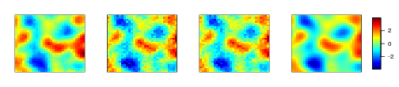
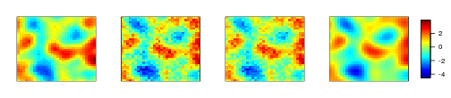
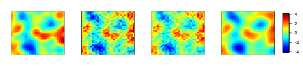
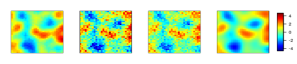
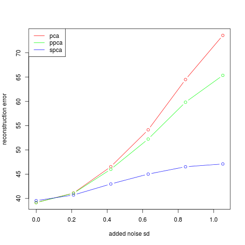
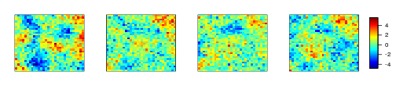
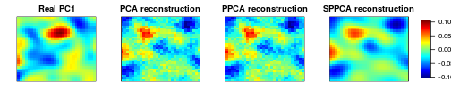
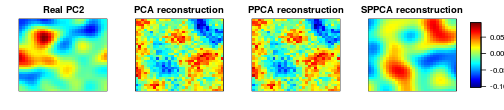

```r
library(fields)

source("../../prior-component-analysis.R", chdir=TRUE)
source("../synthesize_data.R")
source("../../covariance-functions.R")

source("/home/jim/Documents/feature_learning/ppca/ppca-simple.R")

source("/home/jim/R/Library/MultiImage.R")
```

First generate some synthetic data from the model with a squared exponential kernel, try denoising that.


```r
n        = 10
k        = 4
dim      = c(30, 30)
lenScale = c(0.03, 0.03)
synth    = synthesize_data_kern(n, k, dim, lenScale, noisesd = 0.01)
grid     = synth$grid
X        = synth$X
```

Plot some couple of samples


```r
par(mfcol=c(2,2))
multiImage(grid, X[1,], X[2,], X[3,], X[4,])
```



Add different levels of noise and plot reconstruction error for PCA and PrCA with a couple different kernels.


```r
noiseLevels = seq(0, 0.7*sd(X), length=6)
reconstErrs = data.frame(pca =numeric(0),
                         ppca=numeric(0),
                         prca=numeric(0))

for (nli in seq_along(noiseLevels)) {
  X.noisy = X + matrix(rnorm(n*ncol(X), sd=noiseLevels[nli]), nrow=n, ncol=ncol(X))
  X.noisy = scale(X.noisy, scale=FALSE) # Center data

  # PCA
  out.svd  = svd(X.noisy)

  # PPCA
  out.ppca = ppca(X.noisy, k)

  # SPCA
  out.prca = prca(X.noisy, k, grid, exp.MR.cov, exp.MR.cov.d,
                  beta0=log(c(0.1, 0.5)), maxit=10, max.dist=0.5,
                  trace=0, report_iter=5)

  # Reconstructions
  rec.svd  = out.svd$u[,1:k] %*% diag(out.svd$d[1:k]) %*% t(out.svd$v)[1:k,]
  rec.ppca = tcrossprod(out.ppca$V, out.ppca$W)
  rec.prca = tcrossprod(out.prca$V, out.prca$W)

  reconstErrs[nli, c("pca", "ppca", "prca")] = c(
    norm(X - rec.svd,  'F'),
    norm(X - rec.ppca, 'F'),
    norm(X - rec.prca, 'F')
  )

  # Compare reconstructions of sample 1
  multiImage(grid, X[1,], rec.svd[1,], rec.ppca[1,], rec.prca[1,])
}
```



Plot reconstruction error vs added noise for PCA, PPCA, SPCA


```r
par(mfcol=c(1,1))
plot(1, type='n', ylim=range(reconstErrs), xlim=range(noiseLevels),
     ylab="reconstruction error", xlab="added noise sd")
lines(noiseLevels, reconstErrs$pca,  col='red', type='b')
lines(noiseLevels, reconstErrs$ppca, col='green', type='b')
lines(noiseLevels, reconstErrs$prca, col='blue', type='b')
legend('topleft',
       legend=c('pca', 'ppca', 'spca'),
       col=c('red', 'green', 'blue'),
       lty=1)
```



How noisy IS The data from the noisiest setting? Plot 4 samples.


```r
multiImage(grid, X.noisy[1,], X.noisy[2,], X.noisy[3,], X.noisy[4,])
```



Compare real PCs vs ones reconstructed from PCA & SPPCA


```r
multiImage(grid, "Real PC1"=synth$W[,1]/norm(synth$W[,1], 'F'),
                 "PCA reconstruction"=out.svd$v[,1]/norm(out.svd$v[,1], 'F'),
                 "PPCA reconstruction"=out.ppca$W[,1]/norm(out.ppca$W[,1], 'F'),
                 "SPPCA reconstruction"=out.prca$W[,1]/norm(out.prca$W[,1], 'F'))
```



```r
multiImage(grid, "Real PC2"=synth$W[,2]/norm(synth$W[,2], 'F'),
                 "PCA reconstruction"=out.svd$v[,2]/norm(out.svd$v[,2], 'F'),
                 "PPCA reconstruction"=out.ppca$W[,2]/norm(out.ppca$W[,2], 'F'),
                 "SPPCA reconstruction"=out.prca$W[,2]/norm(out.prca$W[,2], 'F'))
```



