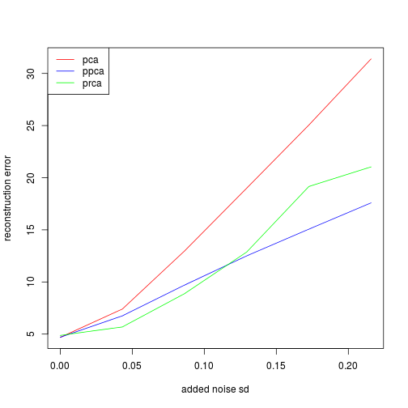

```r
library(functional)
library(fields)

source("../../prior-component-analysis.R", chdir=TRUE)
source("../../covariance-functions.R")
source("~/Documents/uvFAIMS/HE/read_data.R")
source("~/Documents/feature_learning/ppca/ppca-simple.R")

source("/home/jim/R/Library/MultiImage.R")
```

Load data


```r
data.df = read_data()
X = scale(do.call(rbind, data.df$vecs)[,((52224/2)+1):52224], scale=FALSE)
#X = X/svd(X)$d[1]

dim.faims = c(512, 51)
grid = expand.grid(list(x=seq(0, 1, length=dim.faims[1]),
                        y=seq(0, 1, length=dim.faims[2])))

keep = apply(X, 2, sd) > 0.0075
X = X[,keep]
grid = grid[keep,]
```

Use BIC to pick latent dimensionality w/ PPCA (to make test most fair);
pick k=8.


```r
bics = numeric(14)
for (k in 1:14) {
  out.ppca  = ppca(X.noisy, k)
  bics[k] = out.ppca$bic
}
```

Add noise to data and de-noise. Use k=8 because BIC picked this


```r
k = 8
nLevels = 6
noiseLevels = seq(0, 0.055*(max(X)-min(X)), length=nLevels)
reconstErrs = data.frame(pca=numeric(length(noiseLevels)),
                         ppca=numeric(length(noiseLevels)),
                         prca=numeric(length(noiseLevels)))

for (nli in 1:length(noiseLevels)) {
  X.noisy = X + matrix(rnorm(nrow(X)*ncol(X), sd=noiseLevels[nli]), nrow=nrow(X), ncol=ncol(X))

  print(paste("svd", nli))
  out.svd  = svd(X.noisy)

  print(paste("ppca", nli))
  out.ppca  = ppca(X.noisy, k)

  print(paste("prca", nli))
  out.prca = prca(X.noisy, k, grid, exp.MR.cov, exp.MR.cov.d,
                  beta0=log(c(mean(X.noisy^2), 0.4)), maxit=6,
                  report_iter=5, max.dist=0.4, trace=1, ucminf.control=list(
                    trace=0, grtol=1e-2, xtol=1e-2, maxeval=4
                  ))

  rec.svd  = out.svd$u[,1:k] %*% diag(out.svd$d[1:k]) %*% t(out.svd$v)[1:k,]
  rec.ppca = tcrossprod(out.ppca$V, out.ppca$W)
  rec.prca = tcrossprod(out.prca$V, out.prca$W)

  #par(mfcol=c(1,3))
  #plot.surface(as.surface(grid, rec.svd[1,]), type='I', main="svd")
  #plot.surface(as.surface(grid, rec.ppca[1,]), type='I', main="ppca")
  #plot.surface(as.surface(grid, rec.prca[1,]), type='I', main="prca")

  reconstErrs[nli, c("pca", "ppca", "prca")] = c(
    norm(X - rec.svd, 'F'),
    norm(X - rec.ppca, 'F'),
    norm(X - rec.prca, 'F')
  )
}
```

```
## [1] "svd 1"
## [1] "ppca 1"
## [1] "prca 1"
## [1] "Starting prca with 2 hyperparameters"
## [1] "Iteration 0: log likelihood = 263534.7526 (increase=8807500622.931)"
## [1] "Iteration 5: log likelihood = 631017.8031 (increase=3725.8911)"
## [1] "Convergence criteria reached: 6 iterations"
## [1] "svd 2"
## [1] "ppca 2"
## [1] "prca 2"
## [1] "Starting prca with 2 hyperparameters"
## [1] "Iteration 0: log likelihood = 359143.3835 (increase=89585077935.6271)"
## [1] "Iteration 5: log likelihood = 450107.3767 (increase=15946.663)"
## [1] "Convergence criteria reached: 6 iterations"
## [1] "svd 3"
## [1] "ppca 3"
## [1] "prca 3"
## [1] "Starting prca with 2 hyperparameters"
## [1] "Iteration 0: log likelihood = 307762.4422 (increase=238580945143.27)"
## [1] "Iteration 5: log likelihood = 354007.5542 (increase=3000.5467)"
## [1] "Convergence criteria reached: 6 iterations"
## [1] "svd 4"
## [1] "ppca 4"
## [1] "prca 4"
## [1] "Starting prca with 2 hyperparameters"
## [1] "Iteration 0: log likelihood = 260408.2187 (increase=366306239983.362)"
## [1] "Iteration 5: log likelihood = 290605.2172 (increase=5138.9506)"
## [1] "Convergence criteria reached: 6 iterations"
## [1] "svd 5"
## [1] "ppca 5"
## [1] "prca 5"
## [1] "Starting prca with 2 hyperparameters"
## [1] "Iteration 0: log likelihood = 214170.794 (increase=474355858619.321)"
## [1] "Iteration 5: log likelihood = 261083.651 (increase=4273.8672)"
## [1] "Convergence criteria reached: 6 iterations"
## [1] "svd 6"
## [1] "ppca 6"
## [1] "prca 6"
## [1] "Starting prca with 2 hyperparameters"
## [1] "Iteration 0: log likelihood = 188416.8923 (increase=528819453250.919)"
## [1] "Iteration 5: log likelihood = 222766.1999 (increase=6312.1483)"
## [1] "Convergence criteria reached: 6 iterations"
```

Plot reconstruction error vs noise


```r
plot(1, type='n', ylim=range(reconstErrs), xlim=range(noiseLevels), ylab="reconstruction error", xlab="added noise sd")
lines(noiseLevels, reconstErrs$pca, col='red')
lines(noiseLevels, reconstErrs$ppca, col='blue')
lines(noiseLevels, reconstErrs$prca, col='green')
legend('topleft',
       legend=c('pca', 'ppca', 'prca'),
       col=c('red', 'blue', 'green'),
       lty=1)
```



