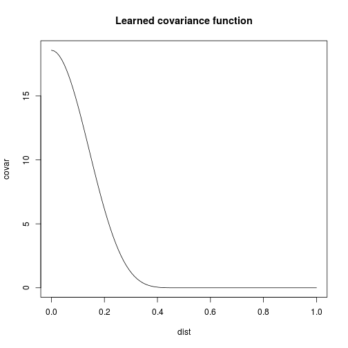

```r
library(fields)
```

```
## Loading required package: spam
```

```
## Loading required package: grid
```

```
## Spam version 1.0-1 (2014-09-09) is loaded.
## Type 'help( Spam)' or 'demo( spam)' for a short introduction 
## and overview of this package.
## Help for individual functions is also obtained by adding the
## suffix '.spam' to the function name, e.g. 'help( chol.spam)'.
```

```
## 
## Attaching package: 'spam'
```

```
## The following objects are masked from 'package:base':
## 
##     backsolve, forwardsolve
```

```
## Loading required package: maps
```

```r
source("../../prior-component-analysis.R", chdir=TRUE)
source("../../covariance-functions.R")
```

```
## 
## Attaching package: 'igraph'
```

```
## The following objects are masked from 'package:stats':
## 
##     decompose, spectrum
```

```
## The following object is masked from 'package:base':
## 
##     union
```

```r
source("/home/jim/Documents/feature_learning/ppca/ppca-simple.R")
source("/home/jim/R/Library/MultiImage.R")

data(ozone2)
```

Missing data: Replace missing values by column means


```r
X = ozone2$y
for (col in 1:ncol(X)) {
  ind = is.na(X[,col])
  X[ind,col] = mean(X[,col], na.rm=TRUE)
}
```

Plot a few samples


```r
locations = ozone2$lon.lat
locations = apply(locations, 2, function(col) (col-min(col))/(max(col)-min(col)))
multiImage(locations, X[1,], X[2,], X[3,], X[4,])
```


Look at BIC for SPCA with and for PPCA. We can see that SPCA picks k=3, PPCA picks k=9 and SPCA always has a higher BIC. This is actually expected, since both SPCA and PPCA will have (approximately) the same model complexity penalty, but PPCA will have a greater model fit.


```r
source("../../prior-component-analysis.R", chdir=TRUE)
source("../../covariance-functions.R", chdir=TRUE)

source("/home/jim/Documents/feature_learning/ppca/ppca-simple.R")

ks = 1:12

bics.spca = numeric(length(ks))
bics.ppca = numeric(length(ks))
for (ki in seq_along(ks)) {
  out.spca = prca(X, ks[ki], locations, exp.MR.cov, exp.MR.cov.d,
                  beta0=log(c(0.1, 0.5)), maxit=15, max.dist=0.5,
                  trace=1, report_iter=15)
  bics.spca[ki] = out.spca$bic

  out.ppca = ppca(X, ks[ki])
  bics.ppca[ki] = out.ppca$bic
}
```

```
## [1] "Starting prca with 2 hyperparameters"
## [1] "Iteration 0: log likelihood = -61100.3582 (increase=13360675607.4193)"
## [1] "Convergence criteria reached: 15 iterations"
## [1] "Starting prca with 2 hyperparameters"
## [1] "Iteration 0: log likelihood = -59710.0759 (increase=15174666855.6006)"
## [1] "Convergence criteria reached: 15 iterations"
## [1] "Starting prca with 2 hyperparameters"
## [1] "Iteration 0: log likelihood = -59410.5243 (increase=16022857802.8379)"
## [1] "Convergence criteria reached: 15 iterations"
## [1] "Starting prca with 2 hyperparameters"
## [1] "Iteration 0: log likelihood = -58005.6461 (increase=16929734687.5344)"
## [1] "Convergence criteria reached: 15 iterations"
## [1] "Starting prca with 2 hyperparameters"
## [1] "Iteration 0: log likelihood = -57788.6356 (increase=19969798406.9073)"
## [1] "Convergence criteria reached: 15 iterations"
## [1] "Starting prca with 2 hyperparameters"
## [1] "Iteration 0: log likelihood = -57493.1518 (increase=21130739587.9022)"
## [1] "Convergence criteria reached: 15 iterations"
## [1] "Starting prca with 2 hyperparameters"
## [1] "Iteration 0: log likelihood = -57320.662 (increase=21812853409.9522)"
## [1] "Convergence criteria reached: 15 iterations"
## [1] "Starting prca with 2 hyperparameters"
## [1] "Iteration 0: log likelihood = -57326.4191 (increase=23099546393.8104)"
## [1] "Convergence criteria reached: 15 iterations"
## [1] "Starting prca with 2 hyperparameters"
## [1] "Iteration 0: log likelihood = -57289.5535 (increase=23449739358.3056)"
## [1] "Convergence criteria reached: 15 iterations"
## [1] "Starting prca with 2 hyperparameters"
## [1] "Iteration 0: log likelihood = -57271.8731 (increase=24273622030.3798)"
## [1] "Convergence criteria reached: 15 iterations"
## [1] "Starting prca with 2 hyperparameters"
## [1] "Iteration 0: log likelihood = -57064.5572 (increase=26019440806.3174)"
## [1] "Convergence criteria reached: 15 iterations"
## [1] "Starting prca with 2 hyperparameters"
## [1] "Iteration 0: log likelihood = -56894.9318 (increase=26840642879.3172)"
## [1] "Convergence criteria reached: 15 iterations"
```

```r
plot(ks, bics.spca, xlab='k', ylab='bic', type='b', main="BIC",
     ylim=range(bics.spca, bics.ppca))
points(ks, bics.ppca, col='green', type='b')
legend("top",
       legend=c("SPCA", "PPCA"),
       col=c("black", "green"),
       pch=1, lty=1)
```


Try looking at crossvalidated log likelihoods instead, as a better measure of model fit. Better! SPCA always has a greater holdout data likelihood. Interesting that they peak at the same place (k=7).


```r
liks.spca = numeric(length(ks))
liks.ppca = numeric(length(ks))
for (ki in seq_along(ks)) {
  trainInd = sample(nrow(X), floor(nrow(X)*0.8))

  trainX = X[trainInd,]

  out.spca = prca(trainX, ks[ki], locations, exp.MR.cov, exp.MR.cov.d,
                  beta0=log(c(0.1, 0.5)), maxit=15, max.dist=0.5,
                  trace=1, report_iter=15)
  liks.spca[ki] = prca.log_likelihood(X[-trainInd,], out.spca$W, out.spca$sigSq)

  out.ppca = ppca(X, ks[ki])
  liks.ppca[ki] = prca.log_likelihood(X[-trainInd,], out.ppca$W, out.ppca$sigSq)
}
```

```
## [1] "Starting prca with 2 hyperparameters"
## [1] "Iteration 0: log likelihood = -49444.2591 (increase=14407643695.1172)"
## [1] "Convergence criteria reached: 15 iterations"
## [1] "Starting prca with 2 hyperparameters"
## [1] "Iteration 0: log likelihood = -48048.8721 (increase=14897247998.2186)"
## [1] "Convergence criteria reached: 15 iterations"
## [1] "Starting prca with 2 hyperparameters"
## [1] "Iteration 0: log likelihood = -48446.8916 (increase=14385623029.4499)"
## [1] "Convergence criteria reached: 15 iterations"
## [1] "Starting prca with 2 hyperparameters"
## [1] "Iteration 0: log likelihood = -47677.5529 (increase=15746350649.1052)"
## [1] "Convergence criteria reached: 15 iterations"
## [1] "Starting prca with 2 hyperparameters"
## [1] "Iteration 0: log likelihood = -46852.9232 (increase=22081744807.9087)"
## [1] "Convergence criteria reached: 15 iterations"
## [1] "Starting prca with 2 hyperparameters"
## [1] "Iteration 0: log likelihood = -45957.5347 (increase=20537746311.7598)"
## [1] "Convergence criteria reached: 15 iterations"
## [1] "Starting prca with 2 hyperparameters"
## [1] "Iteration 0: log likelihood = -46313.1546 (increase=17044244131.4489)"
## [1] "Convergence criteria reached: 15 iterations"
## [1] "Starting prca with 2 hyperparameters"
## [1] "Iteration 0: log likelihood = -46252.331 (increase=24630266672.1623)"
## [1] "Convergence criteria reached: 15 iterations"
## [1] "Starting prca with 2 hyperparameters"
## [1] "Iteration 0: log likelihood = -46104.5255 (increase=25270113240.9913)"
## [1] "Convergence criteria reached: 15 iterations"
## [1] "Starting prca with 2 hyperparameters"
## [1] "Iteration 0: log likelihood = -46260.0727 (increase=24598662711.27)"
## [1] "Convergence criteria reached: 15 iterations"
## [1] "Starting prca with 2 hyperparameters"
## [1] "Iteration 0: log likelihood = -45665.0078 (increase=29609630399.0191)"
## [1] "Convergence criteria reached: 15 iterations"
## [1] "Starting prca with 2 hyperparameters"
## [1] "Iteration 0: log likelihood = -46177.6119 (increase=33031837600.6249)"
## [1] "Convergence criteria reached: 15 iterations"
```

```r
plot(ks, liks.spca, xlab='k', ylab='bic', type='b',
     main="Heldout log likelihoods", ylim=range(liks.spca, liks.ppca))
points(ks, liks.ppca, col='green', type='b')
legend("top",
       legend=c("SPCA", "PPCA"),
       col=c("black", "green"),
       pch=1, lty=1)
```


Rerun w/ k=7


```r
out.spca = prca(X, 7, locations, exp.MR.cov, exp.MR.cov.d,
                beta0=log(c(0.1, 0.5)), maxit=10, max.dist=0.5,
                trace=1, report_iter=5)
```

```
## [1] "Starting prca with 2 hyperparameters"
## [1] "Iteration 0: log likelihood = -57291.4579 (increase=21812853439.1562)"
## [1] "Iteration 5: log likelihood = -50006.0819 (increase=15.2569)"
## [1] "Convergence criteria reached: 10 iterations"
```

We have learnt quite a long length scale; a good sign!


```r
dist = matrix(seq(0, 1, length=100), ncol=1)
covar = exp.MR.cov(X=matrix(0), X2=dist, beta=out.spca$beta, max.dist=0.5)

plot(dist, covar, type='l', main='Learned covariance function')
```



Another PrCA/PPCA comparison; cross-validate and project test-samples onto model. Compare distributions of distances to original points (generalisation error)


```r
#n        = nrow(X)
#err.wend = numeric(n)
#err.ppca = numeric(n)
#for (fold in 1:n) {
#  # PrCA
#  out.wend = prca(X[-fold,,drop=FALSE], 7, covar.fn, beta.init=c(1, log(0.3)),
#                  maxit=10)
#  rec.wend = predict(out.wend, X[fold,,drop=FALSE])
#  err.wend[fold] = sqrt(sum(rec.wend - X[fold,,drop=FALSE])^2)
#
#  # PPCA
#  out.ppca = prca(X[-fold,,drop=FALSE], 3, covar.fn.ppca, beta.init=c(),
#                  maxit=10, warnDiag=FALSE)
#  rec.ppca = predict(out.ppca, X[fold,,drop=FALSE])
#  err.ppca[fold] = sqrt(sum(rec.ppca - X[fold,,drop=FALSE])^2)
#}
#
## Histogram Colored (blue and red)
#hist(err.wend, 100, col=rgb(1,0,0,0.5), xlim=c(0, max(err.wend, err.ppca)),
#     ylim=c(0,45), xlab="Reconstruction error")
#hist(err.ppca, 100, col=rgb(0,0,1,0.5), add=T)
#box()
#
#boxplot(err.wend, err.ppca, names=c("PrCA", "PPCA"))
```

